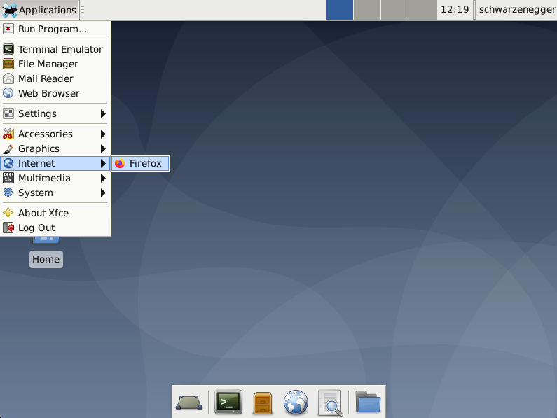
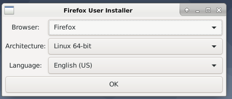
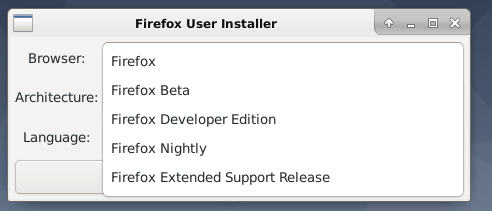
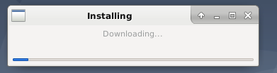
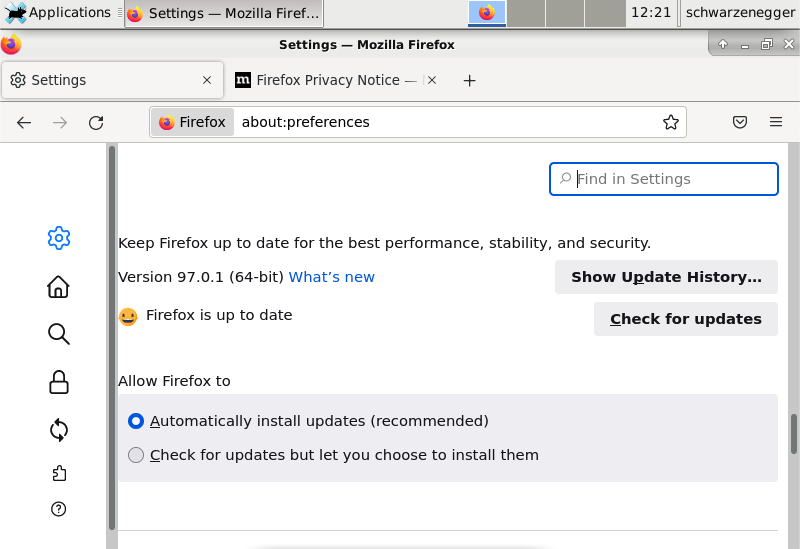

# firefox-user-installer

A debian package to automatically install the latest firefox on debian. With autoupdate support.

## Details

This package will install an icon in the application menu, clicking this
icon will download firefox (latest, beta, nightly, esr, or developer edition) from mozilla's site and install it for the current
user. If firefox was already installed, it will just launch it normally.
Note that the installed firefox supports auto-updating, so it can always be
kept up to date, even when testing enters freeze.

## Screenshots

## Requirements

- An x86 or amd64 processor
- debian 10 and above (submit an issue if debian 9 support is needed)

## Usage

Download a package from this project's [releases page](https://github.com/degaart/firefox-user-installer/releases) (https://github.com/degaart/firefox-user-installer/releases), depending on your system version:

- 32-bit debian: [firefox_user_installer_0.1.0_i386.deb](https://github.com/degaart/firefox-user-installer/releases/download/v0.1.0/firefox_user_installer_0.1.0_i386.deb)
- 64-bit debian: [firefox_user_installer_0.1.0_amd64.deb](https://github.com/degaart/firefox-user-installer/releases/download/v0.1.0/firefox_user_installer_0.1.0_amd64.deb)
- 64-bit Ubuntu 22.04: [firefox_user_installer_0.1.0-ubuntu2204_amd64.deb](https://github.com/degaart/firefox-user-installer/releases/download/v0.1.0/firefox_user_installer_0.1.0-ubuntu2204_amd64.deb)
- File an issue if you need support for other distros

Then install the package using apt:

    sudo apt install ./firefox_user_installer_0.1.0_amd64.deb

Replace `firefox_user_installer_0.1.0_amd64.deb` with the name of the package
you downloaded.

Changing the installed firefox version can be done by launching it
with the `--reset` argument:

    firefox --reset

To uninstall, you have to uninstall the firefox_user_installer package and
remove the downloaded firefox:

    sudo apt purge firefox_user_installer
    rm -r $HOME/.local/share/firefox-user-installer

